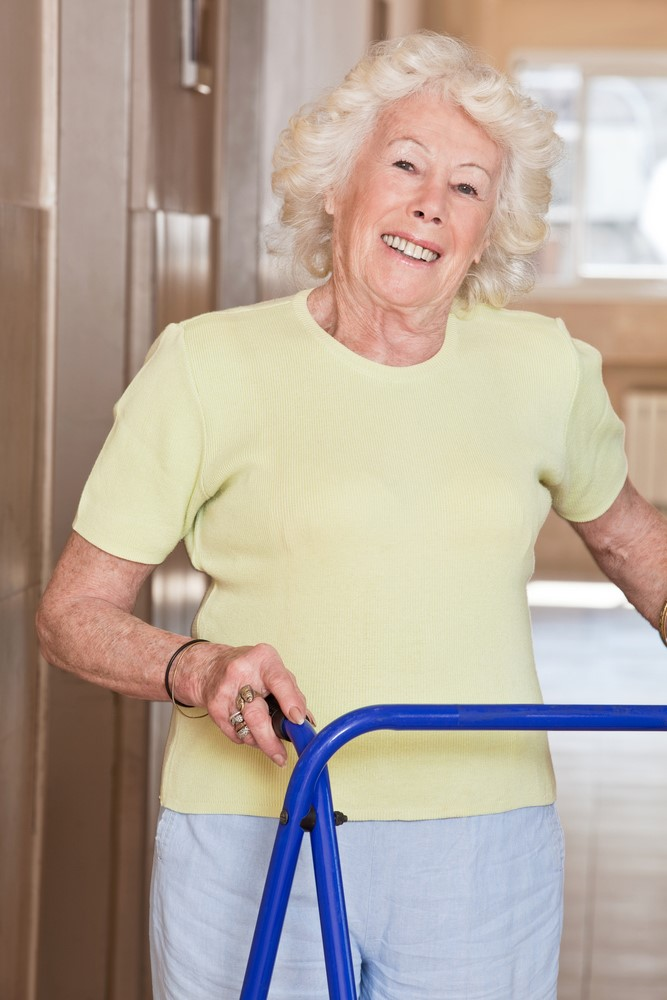
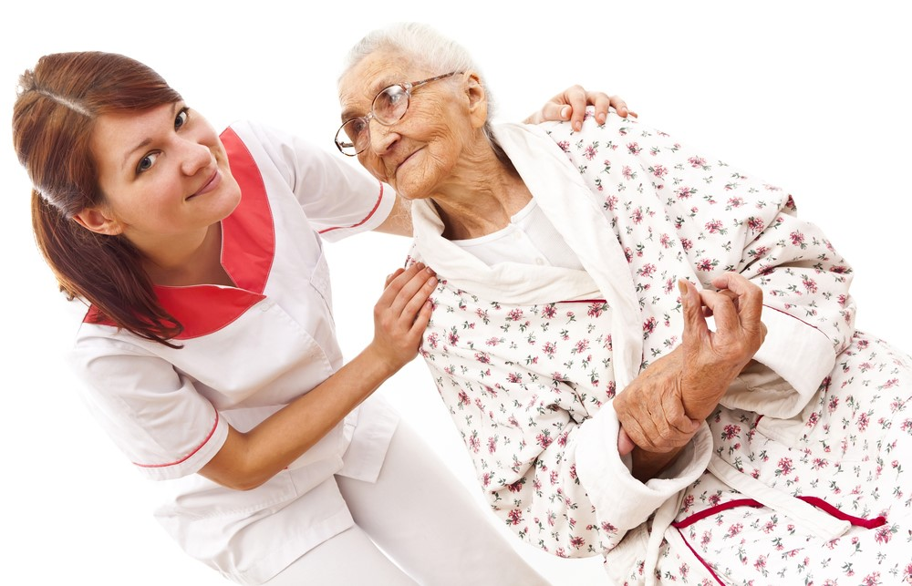

  
Therapy is an important resource to use when health declines.  It can tremendously improve the quality of life for your loved one.  

          
 Therapy is a bit of an unsung hero when it comes to declining health.  There are many types of therapy available.  You are probably unaware of all of the resources that can be used. For instance, Speech Therapy can be used to improve swallowing or to help prevent aspirations and pneumonia.  Memory re-training and Problem solving therapy can be engaged or strategies can be used to help with mild decreased memory.  Therapists can also assist with medication management.

          
Occupational therapy can be used to help with self-care skill and strategies, including equipment to safely shower, dress, feed oneself, and cooking.

          
Range of motion in the hands, elbows, shoulders and legs can be improved through therapy, and fitting a person for medical equipment like wheel chairs and walkers and training and assessment for home safety is also done by therapist.

          
Physical Therapists help people walk better (gait training) if they have had an illness, stroke, or have become physically weak.
                    
          

  
Physical Therapy is important after a knee or hip replacement, or for pain management.  Therapists also teach patients how to transfer from bed to chair more safely and with less pain when they have experienced a decline.

  
Therapy can be used to strengthen a person’s ability to get around.  Even if your loved one cannot walk, therapists can teach them how to use the best of what they have for their benefit.  They can help your loved one learn how to transfer from one stationary place to another, walk better and provide exercises to give them added strength to care for themselves.  

  
If you can get your loved one to a better physical place, the cost of the care will more than likely go down.  Therapy  is an invaluable resource to understand and use.

   

